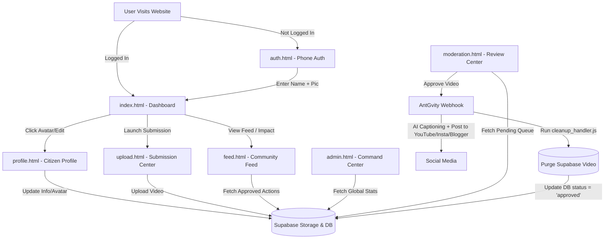

# WeCareBidar - Youth Environmental Revolution Workflow

WeCareBidar is a zero-storage footprint, youth-driven environmental portal that enables youth to upload cleanup campaigns, ecological actions, and local green campaigns. The portal automatically distributes approved actions to social media and purges files to maintain a 0MB storage footprint.

---

## 📂 Project Structure & Pages

The application is split into static interfaces connected to **Supabase** (Backend-as-a-Service) and **AntGvity** (Activepieces Automation Workflow).

---

## 📃 Page-by-Page Description

### 1. 🔐 Authentication & Profile setup (`auth.html` & `auth.js`)
* **Purpose:** Handles new registration and user identification.
* **How it works:**
  1. **Mobile Number Input:** User inputs their mobile number (e.g. `+919876543210`).
  2. **OTP Verification:** standard Supabase OTP verification is attempted. If SMS settings are not active in your Supabase dashboard, the app automatically switches to **Developer Sandbox Mode** (warning banner shows up, and you can type any 6-digit code like `123456` to pass).
  3. **Profile Registration:** If a user registers for the first time, they are prompted to enter their Full Name and upload a profile picture. The profile picture is uploaded to the `avatars` bucket in Supabase storage, and metadata is saved in `public.profiles`.
  4. **Session Save:** The authenticated session is saved in the browser so they don't have to log in again.

### 2. 🚀 Revolution Portal & Dashboard (`index.html` & `app.js`)
* **Purpose:** The main dashboard for youth contributors (Rebels) to see their verified uploads and access submission portals.
* **Components:**
  * **Header Profile Panel:** Displays the user's avatar, name, and total approved submissions. Clicking the avatar or the edit icon redirects the user to their dedicated profile page (`profile.html`).
  * **Revolutionary Statistics Grid:** Displays stats for the user's verified actions, the active community contributors, and the zero storage residue tracker.
  * **Submission Center Promotion:** Instead of inline forms, a promotional banner links users directly to the dedicated uploader (`upload.html`).
  * **Navigation Links:** Points users directly to the public live community feed (`feed.html`).

### 3. 👤 Citizen Profile Management (`profile.html` & `profile.js`)
* **Purpose:** A dedicated hub for citizens to inspect their credentials, update personal details, and see unlocked badges.
* **Features:**
  * **Digital ID Card**: Shows user avatar, name, WCB Citizen ID, Rank status, and a real dynamic QR code.
  * **Personal Information**: Allows toggling into Edit mode to update Name, Email, District, and select from interactive Interests tags.
  * **Recognition & Awards**: Displays achievement medals (Seed Planter, Water Saver, Energy Guru, Community Lead) that unlock based on total verified actions count.
  * **Account Control**: Provides options to log out or permanently delete all user records and database actions.

### 4. 📤 Mission Submission Center (`upload.html` & `upload.js`)
* **Purpose:** A dedicated uploader interface for contributors to submit environmental cleanup videos and details.
* **Features:**
  * **High-Fidelity Dropzone**: Allows dragging and dropping or browsing for MP4/MOV videos up to 40MB.
  * **Real-time Progress Tracker**: Dynamically streams the raw upload percentage to Supabase storage.
  - **Structured Campaign Fields**: Inputs for Title, Operation Zone, Classification Category, and 300-char limited Field Notes.
  - **Lifecycle Tracker**: Animates the submission flow timeline dynamically.

### 5. 📊 Command Center Dashboard (`admin.html` & `admin.js`)
* **Purpose:** A secure, administrative overview dashboard showing real-time statistics, environmental impact progression, active contributor stats, and activity event logs.
* **How it works:**
  * **Login:** Admin logs in using their decryption service token key. Once logged in, credentials are saved in `localStorage` for auto-login.
  * **Real-time Monitoring**: Connects to Supabase to calculate the pending Review Queue size, active rebels count, and platform health.
  * **Environmental Impact Metrics**: Automatically calculates trees supported (approved actions * 50) and waste cleaned (approved actions * 150kg) to update progress bars in real-time.
  * **Activity Center Event Logs**: Renders a live feed of the latest 5 verified environmental actions completed by community rebels.
  * **Webhook Configuration**: Allows admins to modify the active webhook endpoint url.

### 6. 🌐 Environmental Impact Gallery (`feed.html` & `feed.js`)
* **Purpose:** Public Community Feed page showing real-time conservation impact.
* **Features:**
  - **Live Movement Statistics**: Animates total approved actions, Waste Removed (actions * 150kg), and Trees Planted (actions * 50 trees) dynamically.
  - **Category Filtering**: Sticky navigation bar filtering by specific ecological categories (Waste & Plastic, Tree Plantation, Water Conservation, Civic Awareness).
  - **Dynamic Masonry Grid**: Renders contributor profile details, verified location, notes, and dynamic content.
  - **Hover-to-Play Video**: Videos play muted on mouse enter and pause on mouse leave.
  - **Zero-Footprint Purge Badges**: For successfully distributed and purged posts, displays a custom 0MB storage residue indicator badge.

### 7. 🏆 Environmental Hall of Fame (`leaderboard.html` & `leaderboard.js`)
* **Purpose:** Displays dynamic rankings of citizens based on verified environmental actions.
* **Features:**
  - **Global Metrics**: Animates trees supported, waste removed (formatted in tons), and active citizen counts.
  - **Podium Visual Grid**: Renders cards for 1st, 2nd, and 3rd rank holders. The 1st place podium slot has a gold rank badge and special elevated styling.
  - **Rankings Table**: Displays a table for ranks 4 and below listing name, district, eco title, verified uploads, and impact scores.
  - **Rank Sort Algorithm**: Renders rankings sorted descending by verified uploads count, resolving ties ascending by user profile creation date.

### 8. ℹ️ Movement Manifesto (`about.html` & `about.js`)
* **Purpose:** Static manifesto page telling WeCareBidar's narrative and mission.
* **Features:**
  - **Hero Manifesto**: Highlights the movement's mission with background graphics and cinematic styling.
  - **Collaborative Story**: Presents a detailed story block detailing environmental stewardship and community intentions.
  - **Navbar state binding**: Updates header controls based on login credentials.

### 9. 📞 Public Contact Us Inquiry (`contact.html` & `contact.js`)
* **Purpose:** A public-facing form page for citizens, partners, or volunteers to send secure messages to ECO-COMMAND coordinators.
* **Features:**
  - **Auto-Prefill Session Info**: Checks active Supabase or Sandbox sessions to prefill the Full Name and Secure Email Address inputs.
  - **Inquiry Classification**: Allows selecting between "Partnership Request" and "Volunteer Support" categories.
  - **Secure Transmission Form**: Validates details and simulates encrypted transmission protocols with visual success toasts.
  - **Operational Metrics & Shortcuts**: Displays Average Response Time, NGO verification badges, and direct links to social networks (LinkedIn, WhatsApp, Telegram).
### 10. 🛡️ Review Center Workspace (`moderation.html` & `moderation.js`)
* **Purpose:** Highly interactive administrative verification workspace for reviewing and moderating individual pending campaign submissions.
* **Features:**
  - **Premium Media Viewer**: Autoplay HTML video player streaming raw field evidence.
  - **Checklist Guardrails**: Enforces safety verification checks (No Hate, No Violence, Eco Authenticity) before enabling action inputs.
  - **Decision Actions**: Provides feedback annotation and triggers Approve, Request Revision, or Reject sequences (integrated directly with Supabase Storage and AntGvity webhook systems).
  - **Timeline Logs**: Dynamic Audit Trail visual logging assignment and screening milestones.

---

## ⚡ Activepieces / AntGvity Automation Workflow

Once an action is approved on `admin.html`, the automation workflow defined in `antgvity_workflow.json` is triggered:

1. **Webhook Trigger:** Receives the approved video metadata.
2. **AI Enrichment (InVideo):** Enriches the description to create dynamic, youth-driven copy with catchy titles and hashtags.
3. **Router Blast:**
   * **YouTube Shorts Branch:** Uploads the video as a public Short.
   * **Meta Reels Branch:** Posts the video to Instagram and Facebook Page Reels.
   * **Blogger Branch:** Creates a blogger post using the AI description and temporary video links.
4. **Zero-Residue Storage Cleanup (`cleanup_handler.js`):**
   * Calls the Supabase Storage API using the service role key to permanently delete the video file from the `temporary-videos` bucket.
   * Updates the `submissions` table: clears the `video_url` column to release database storage and updates the status to `approved`.
   * Resets storage residue back to `0MB`.
